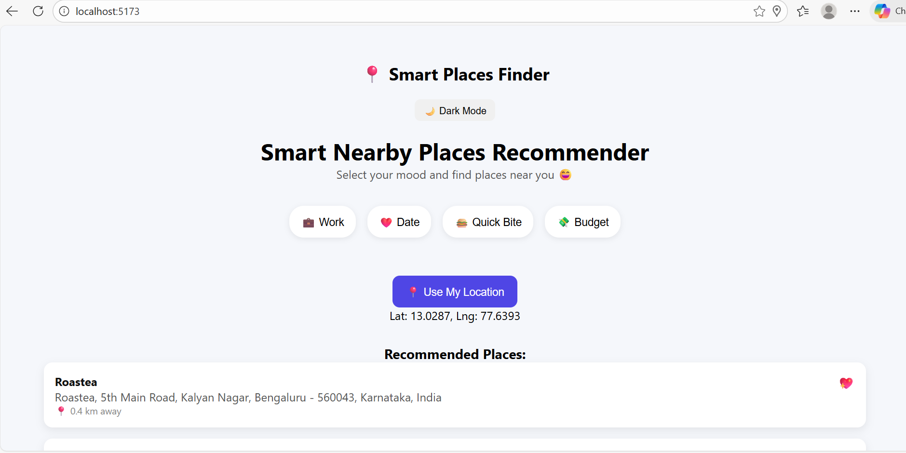
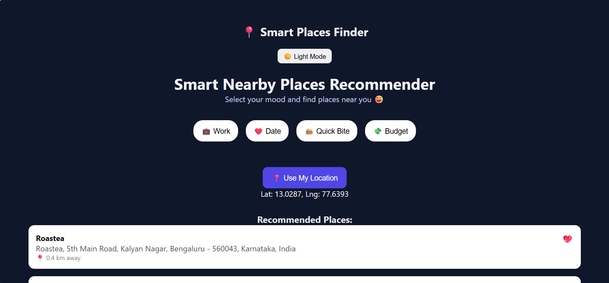
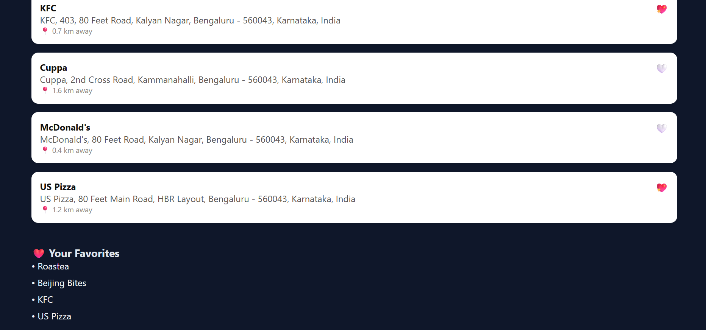

# 🌍 Smart Nearby Places Recommender

A modern React-based web app that recommends nearby places based on your mood using real-time location and live APIs.

Built with a strong focus on **real-world UX, clean UI, and production-ready frontend practices**.

---

## 🚀 Live Demo

👉 https://smart-places-recommender-123.vercel.app/

---

## ✨ Features

* 📍 Real-time location detection (Geolocation API)
* 🎯 Mood-based recommendations (Work, Date, Quick Bite, Budget)
* 🌐 Live Places API integration (Geoapify)
* 📏 Distance calculation using geo math
* ⭐ Dynamic ratings display (when available)
* ❤️ Favorites system with toggle support
* 🌙 Dark mode support
* ⚡ Fast Vite + React architecture
* 📱 Clean modern UI

---

## 📸 Screenshots

### 🌞 Light Mode



### 🌙 Dark Mode



### ❤️ Favorites Feature



---

## 🧠 Problem It Solves

People often struggle to quickly find suitable nearby places based on context (work, date, food, budget).
This app simplifies discovery using:

* Mood-driven filtering
* Real-time location awareness
* Smart and minimal UI

---

## 🛠 Tech Stack

### Frontend

* React (Vite)
* JavaScript (ES6+)
* CSS3

### APIs

* Geoapify Places API
* Browser Geolocation API

### Tools

* VS Code
* GitHub
* Vercel (deployment)

---

## ⚙️ Installation (Run Locally)

```bash
# Clone repo
git clone https://github.com/MeghanaUllas20/smart-places-recommender.git

# Go inside project
cd smart-places-recommender

# Install dependencies
npm install

# Run development server
npm run dev
```

---

## 🔑 Environment Setup

Create a free API key from:
https://www.geoapify.com/

Then replace the key in:

```
src/api/placesApi.js
```

---

## 📦 Folder Structure

```
src/
 ├── components/
 │   ├── Header.jsx
 │   ├── MoodSelector.jsx
 │   ├── LocationButton.jsx
 │   └── PlacesList.jsx
 ├── api/
 │   └── placesApi.js
 ├── styles/
 │   └── app.css
 └── App.jsx

images/
 ├── light-mode.png
 ├── dark-mode.png
 └── favorites.png
```

---

## 🎯 Key Highlights

* Built completely from scratch without UI frameworks
* Handles loading, empty states, and API responses
* Clean component-based architecture
* Beginner-friendly yet production-minded design

---

## 🚀 Future Improvements

* 📱 Fully responsive mobile layout
* 🗺 Map-based results view
* 💾 Persistent favorites (localStorage)
* 🔍 Search and advanced filters
* 🌎 Multi-city recommendations

---

## 👩‍💻 Author

**Meghana U**

GitHub: https://github.com/MeghanaUllas20

---

## ⭐ Support

If you like this project, consider giving it a ⭐ on GitHub — it helps a lot!
